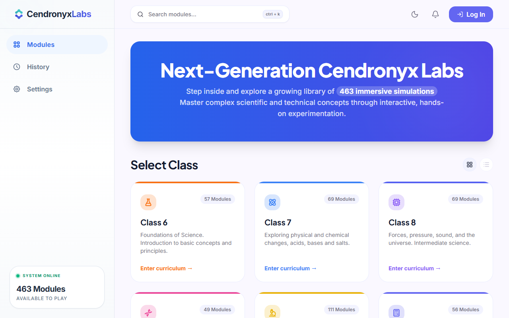
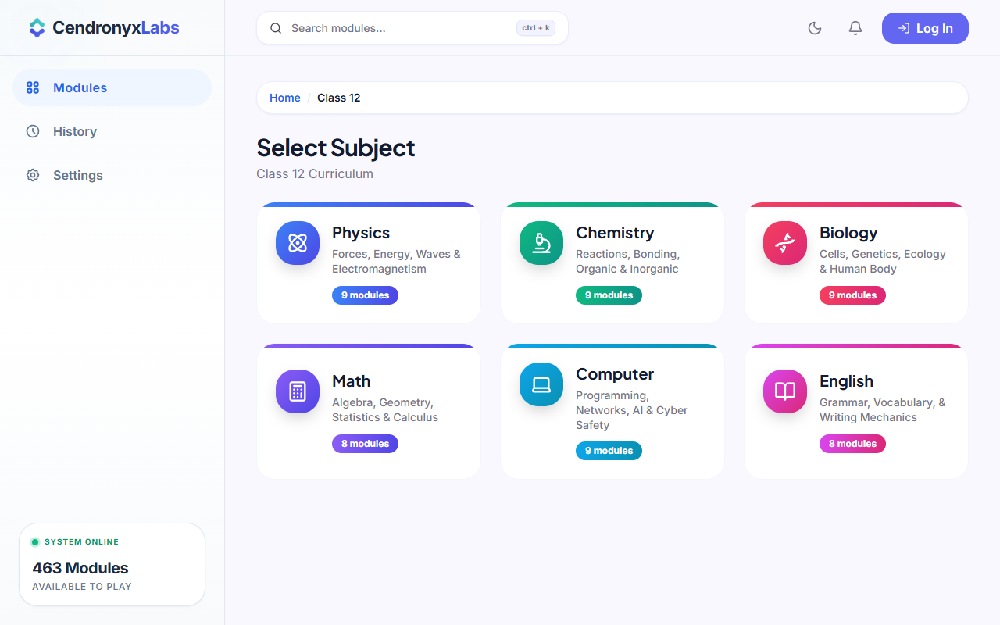
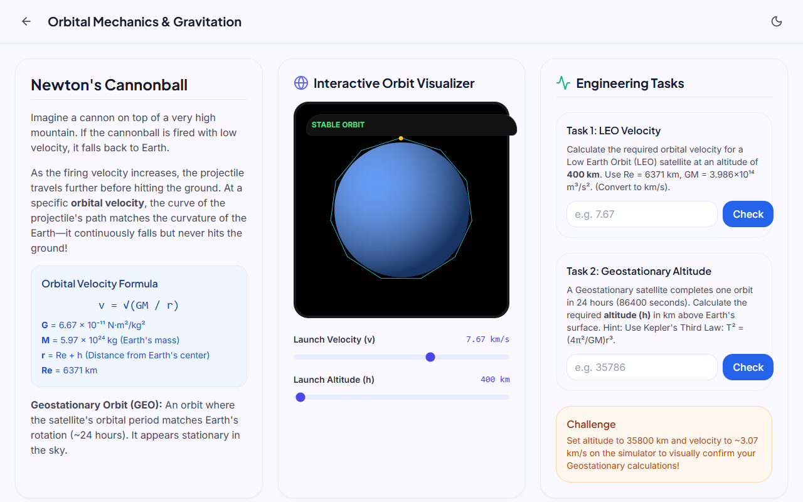
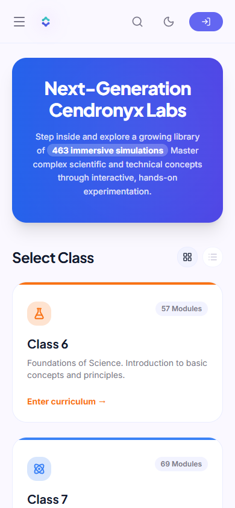

# Cendronyx Labs

> **Cendronyx Labs is an offline-first Progressive Web App that delivers 464 interactive simulations for Science, Mathematics, Computer Science, and English, aligned with Grades 6–12 curricula. Designed for schools with limited internet access, it transforms traditional lessons into immersive, hands-on learning experiences.**

## 👁️ Vision
To make high-quality interactive STEM and language education accessible to every student in Pakistan, regardless of internet connectivity or laboratory resources.

## 📸 Screenshots

| Home Page | Subject Selection |
|:---:|:---:|
|  |  |

| Interactive Lab | Mobile View |
|:---:|:---:|
|  |  |

## ✨ Key Features
- ✅ **464 interactive virtual labs** spanning multiple subjects.
- ✅ **Offline-first Progressive Web App** architecture.
- ✅ **Installable** on Windows, Android, iOS, and Chromebooks.
- ✅ **Dark & Light themes** perfectly customized for readability.
- ✅ **Responsive design** optimized for both desktop and mobile devices.
- ✅ **Interactive quizzes** and assessments to test student comprehension.
- ✅ **Real-time simulations** driven by dynamic inputs.
- ✅ **Curriculum organized** systematically by grade and subject.

## 🚀 What This Web App Does
This application serves as a massive suite of **interactive educational simulations**. It replaces static textbook diagrams with dynamic, interactive digital laboratories where students can tweak parameters (like voltage, temperature, mass, and velocity) and instantly observe real-time visual results. 

Each module in the application typically features a meticulously balanced three-column layout (on desktop) consisting of:
1. **Theory & Setup**: Explains the underlying concepts, formulas, and expectations, while providing interactive controls (sliders, buttons, toggles) to manipulate the simulation.
2. **Interactive Simulator / Visualizer**: A custom-built SVG or Canvas-based visual rendering of the experiment or concept that reacts immediately to user input.
3. **Data & Analysis**: Dynamic tables, assessments, and real-time logs that record the results of the experiment.

The application is fully responsive, condensing into a streamlined, tab-based mobile experience that ensures students can learn interactively on any device.

## 📡 Offline-First & PWA Architecture
A core pillar of this platform is its **Offline-First** design. Built as a Progressive Web Application (PWA) with aggressive service worker caching, Cendronyx Labs is explicitly engineered for environments with unreliable or zero internet connectivity.
- **Offline Reliability**: Designed to function fully offline after the initial installation. All 464 lab modules, SVG simulations, interactive logic, and assets are fully precached locally on the user's device. 
- **Installable**: Students can "install" the web app directly to their home screens or desktops, functioning indistinguishably from a native application.
- **Performance**: Near-instant local performance, as simulations run directly on the device rather than relying on server-side rendering.

## 🎯 What Is It Good For?
- **Low-Bandwidth / Remote Education**: Provides world-class, high-fidelity STEM education to students in regions with limited or intermittent internet access.
- **Visualizing Abstract Concepts**: Makes invisible forces (like electromagnetic fields, molecular bonding, algorithmic sorting, or atomic structures) visible and intuitive.
- **Safe Experimentation**: Students can explore dangerous reactions (like the Electrolysis of Molten Lead Chloride) or extreme physics scenarios without any physical risk.
- **Cross-Disciplinary Education**: Provides a unified platform for learning not just the hard sciences, but also applied mathematics, computer programming, and English grammar/vocabulary.
- **Scalable Education Delivery**: Schools and institutions can deploy this lightweight, highly performant React application to thousands of students simultaneously without incurring massive server or bandwidth costs.

## 📚 Curriculum Breakdown
The platform contains a staggering **464 distinct interactive modules** spanning across Grades 6 through 12. Below is the detailed breakdown of the curriculum by Grade and Subject:

### Grade 6 (59 Labs)
- **Computer Science**: 22 labs
- **Science**: 21 labs
- **English**: 8 labs
- **Mathematics**: 8 labs

### Grade 7 (69 Labs)
- **Science**: 30 labs
- **Computer Science**: 23 labs
- **English**: 8 labs
- **Mathematics**: 8 labs

### Grade 8 (68 Labs)
- **Science**: 41 labs
- **Computer Science**: 11 labs
- **English**: 8 labs
- **Mathematics**: 8 labs

### Grade 9 (49 Labs)
- **Physics**: 10 labs
- **Mathematics**: 9 labs
- **Computer Science**: 9 labs
- **English**: 8 labs
- **Chemistry**: 7 labs
- **Biology**: 6 labs

### Grade 10 (111 Labs)
- **Physics**: 36 labs
- **Chemistry**: 27 labs
- **Mathematics**: 19 labs
- **Computer Science**: 14 labs
- **English**: 8 labs
- **Biology**: 7 labs

### Grade 11 (56 Labs)
- **Physics**: 13 labs
- **Chemistry**: 10 labs
- **Biology**: 9 labs
- **Computer Science**: 8 labs
- **Mathematics**: 8 labs
- **English**: 8 labs

### Grade 12 (52 Labs)
- **Physics**: 9 labs
- **Chemistry**: 9 labs
- **Computer Science**: 9 labs
- **Biology**: 9 labs
- **Mathematics**: 8 labs
- **English**: 8 labs

## 🛠️ Technology Stack
- **Framework**: React (Vite)
- **Progressive Web App**: Vite PWA Plugin for Service Worker precaching & offline-first delivery
- **Styling**: Tailwind CSS (with highly customized dark mode integration)
- **Icons**: Lucide React
- **Animations/Visuals**: React state-driven SVG manipulations
- **Architecture**: Component-based architecture with robust mobile-responsive CSS flexbox implementations.
